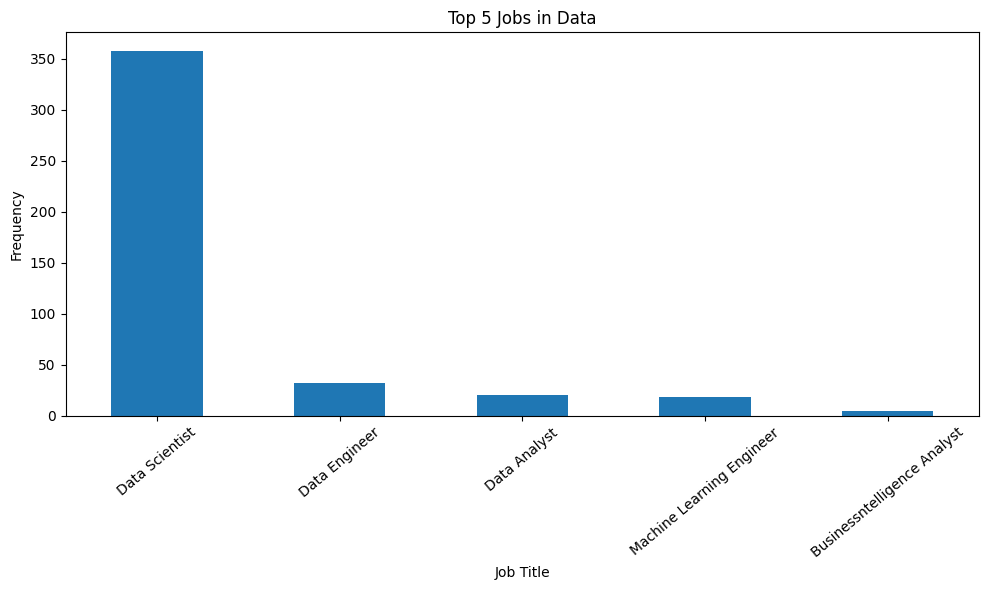
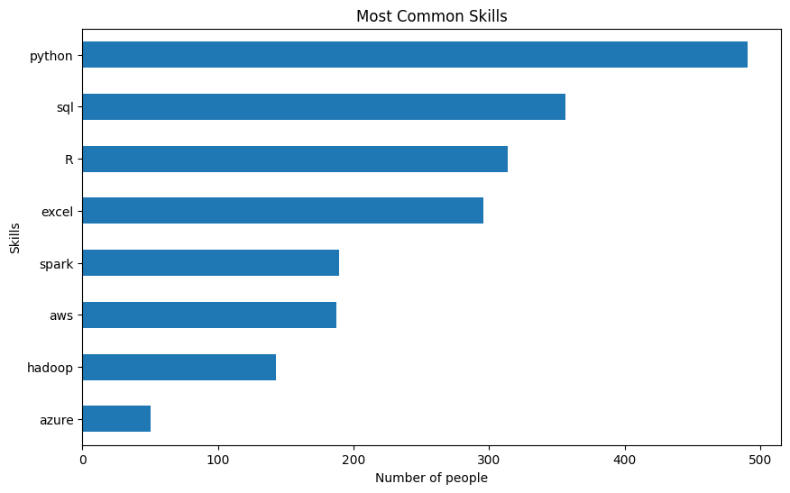
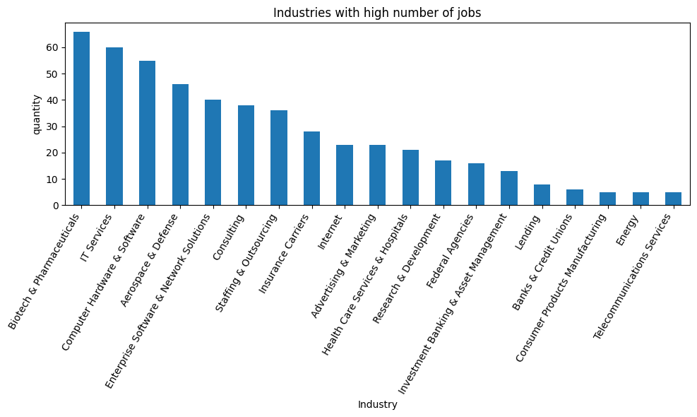

# Data Job Posting Glassdoor

You can find the dataset in the following link: <a href="https://www.kaggle.com/datasets/rashikrahmanpritom/data-science-job-posting-on-glassdoor">Data Sciencie Job Posting on Glassdoor</a>
This is a exploratory data analysis for study proporses using the Data Sciencie Job Posting on Glassdoor.
In this project was used Python Pandas, Numpy and re (Regex) for analysing data.

### Exploratory Data Analysis
- Data collection and cleaning
- Scrapping information from Job description column

Some of the questions to answers:
- What are the most common job titles in the dataset?

Analyzing the frequency of different job titles to understand the diversity of roles available in the dataset, we could find out that Data Scientist roles are the top in Glassdoor for Data jobs, followed by Data Enginner and Data Analytics.

- What is the distribution of job postings by location?
  
The most jobs posting are in California with 165 positions, followed by Virginia and Massachusetts.
The least jobs posting are in Louisiana, Mississippi and Kansas.

- Which skills are most commonly required in job postings?

Using the provided graph, it becomes evident that Python is the most commonly requested skill in jobs, followed by SQL and R.  
We can also observe that Excel holds a prominent position, despite its constraint in handling large volumes of data.

- Which industries have the highest number of job postings?

Listed the top 20 industries with the highest numbe of job postings in Glassdoor for Data Science.
The highest is Biotech & Pharmaceitical industries.

- What is the average salary for different job titles?
- What is the relationship between years of experience and salary?
